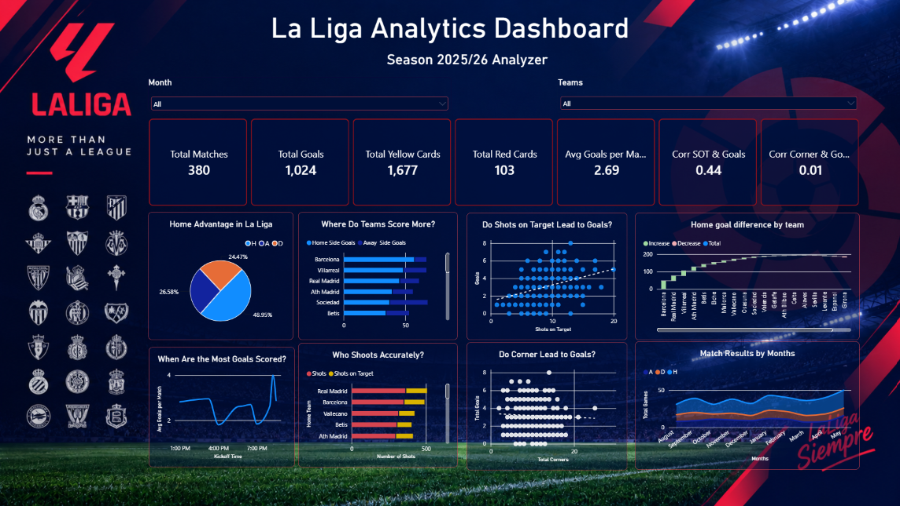

# La Liga Analytics: Power BI Dashboard

An interactive Power BI dashboard analysing the **2025/26 La Liga season** (380 matches, 20 teams), with a focus on **home advantage**, **shot accuracy** and on relationships between match statistics such as shots on target, corners and goals.

## Dashboard Preview



## Dataset

- **File:** `Laliga_cleaned.csv`
- **Grain:** one row per match (380 rows)
- **Key columns:**
  - Match info: `Division` (SP1), `Match_Date`, `Match_Time`, `Home_Team`, `Away_Team`
  - Results: `Full_Time_Home_Goals`, `Full_Time_Away_Goals`, `Full_Time_Result` (H / D / A), half-time equivalents
  - Match stats (home and away): shots, shots on target, fouls, corners, yellow cards, red cards

## Dashboard Overview

**Filters**
- Month slicer
- Team slicer (every visual responds to it)

**KPI cards**
| KPI | Value |
|---|---|
| Total Matches | 380 |
| Total Goals | 1,024 |
| Total Yellow Cards | 1,677 |
| Total Red Cards | 103 |
| Avg Goals per Match | 2.69 |
| Corr SOT & Goals | 0.44 |
| Corr Corners & Goals | 0.01 |
| Total Home Goals | 598 |
| Total Away Goals | 426 |

**Visuals**
1. **Home Advantage in La Liga** (pie): share of Home Win / Away Win / Draw (48.95% / 26.58% / 24.47%)
2. **Where Do Teams Score More?** (bar): home vs away goals scored by each team
3. **Do Shots on Target Lead to Goals?** (scatter with trend line): shots on target vs goals
4. **Home goal difference by team** (waterfall/bar): increase / decrease / total goal difference at home
5. **When Are the Most Goals Scored?** (line): average goals by kickoff time slot
6. **Who Shoots Accurately?** (stacked bar): total shots vs shots on target by team
7. **Do Corners Lead to Goals?** (dot/scatter): total corners vs total goals
8. **Match Results by Months** (stacked area): home wins, draws and away wins from August to May

## Key Insights

- **Home advantage is strong:** home teams won about 49% of matches versus 27% for away teams and 24% draws.
- **Shot accuracy matters:** the correlation between shots on target and goals is moderate and positive (r ≈ 0.44).
- **Corners do not predict goals:** the correlation between total corners and total goals is essentially zero (r ≈ 0.01).
- **Goals split:** 1,024 goals in total (2.69 per match), with home teams scoring 598 versus 426 for away teams.
- **Discipline:** 1,677 yellow cards and 103 red cards across the season.

## Tools and Techniques

- **Power BI Desktop** for data modelling and visualisation
- **DAX** for calculated columns and measures (for example, total goals, averages, correlation measures)
- Custom dark theme with La Liga styling
- Interactive slicers for month and team filtering
- Scatter charts with trend lines to visualise correlation
- Waterfall chart for home goal difference and stacked area for monthly results

## Repository Contents

```
├── Laliga_cleaned.csv             # source data
├── LaligaAnalyzer2025-2026.pbix   # Power BI report
├── LaLigaAnalyzer.png             # dashboard screenshot
└── README.md
```

## How to Use

1. Download or clone this repository.
2. Open `LaligaAnalyzer2025-2026.pbix` in **Power BI Desktop**.
3. If prompted, point the data source to your local copy of `Laliga_cleaned.csv`.
4. Use the Month and Team slicers to explore the season.

## Possible Extensions

- League table (points, goal difference) built with a team-perspective table
- Shots vs shots on target conversion rate by team
- Referee-level discipline analysis
- Kickoff-time effect on goals and results
- Home vs away comparison for fouls and cards
